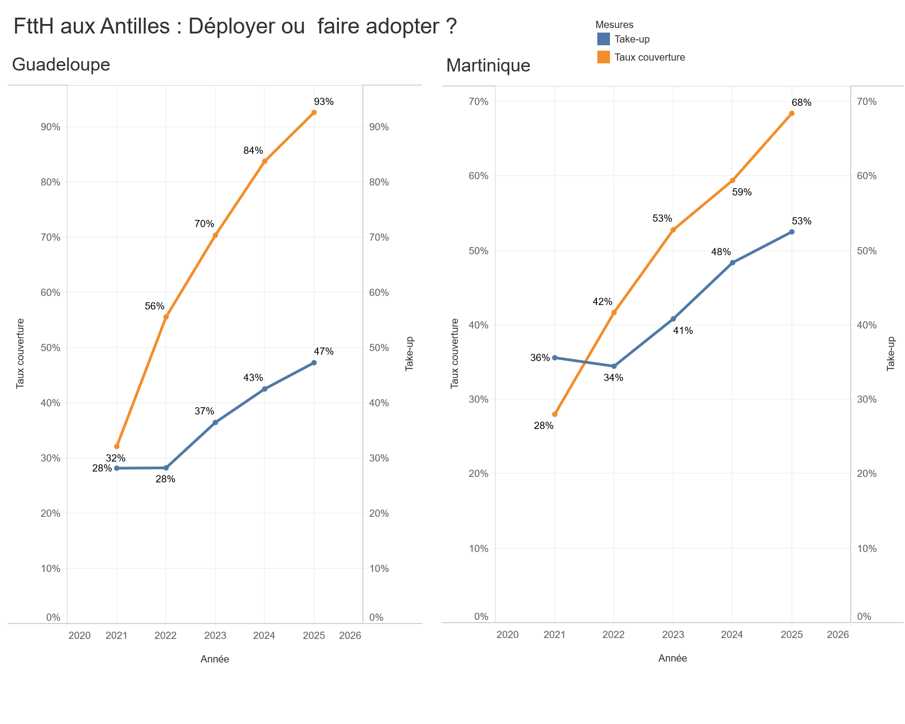

# FTTH aux Antilles : déployer ou faire adopter ?

**Cas d'étude Data Analyst · Capstone Google Data Analytics (Track B)**
Par Maritza Brival

Analyse comparée du déploiement et de l'adoption de la fibre optique (FTTH) en Guadeloupe et en Martinique, à partir des données ouvertes de l'ARCEP.

---

## La question

Le gouvernement visait 100 % de couverture FTTH pour fin 2025 dans l'Hexagone et les outre-mer. L'échéance a été repoussée à 2030, en parallèle de l'arrêt progressif du cuivre (ADSL).

**La Collectivité Territoriale de Martinique et la Région Guadeloupe doivent-elles concentrer leurs efforts pour augmenter la couverture, ou faire adopter l'existant ?**

> Périmètre : les chiffres « Guadeloupe » incluent les collectivités de Saint-Martin et Saint-Barthélemy (971 + 977 + 978). Martinique = 972.

## En bref

La Guadeloupe a beaucoup plus déployé que la Martinique (couverture 93 % contre 68 % fin 2025), mais son adoption reste à la traîne et passe même sous celle de la Martinique (47 % contre 53 %).

La Guadeloupe a gagné la bataille du déploiement, pas celle de l'usage : fin 2025, plus de la moitié de ses locaux raccordables n'ont toujours pas d'abonnement fibre. La Martinique doit encore avancer sur les deux fronts, en priorité sur la couverture.



## Les données (Prepare)

Source : rapport *Services de communications électroniques dans les départements et collectivités d'outre-mer — Année 2025* (ARCEP, publié en 2026), et les jeux de données associés sur data.gouv.fr (licence ouverte).

L'ARCEP, autorité administrative indépendante, collecte ces données de façon obligatoire auprès des opérateurs commerciaux (OC) et d'infrastructure (OI), au titre des articles L.135, L.33-1 et L.34-8-3 du CPCE.

Grille de qualité **ROCCC** :

- **Reliable (fiables)** : collecte obligatoire, opérée par le régulateur.
- **Original (originales)** : issues des systèmes internes des OI/OC (emplacement des PM, adresses des locaux raccordables, abonnés actifs).
- **Comprehensive (complètes, avec une limite assumée)** : séries pluriannuelles THD et FTTH sur tous les territoires, mais la qualité de service outre-mer ne figure pas dans l'open data.
- **Current (récentes)** : 2015-2025 pour le THD, 2021-2025 pour le FTTH.
- **Cited (citées)** : rapport et données publics (liens en bas de page).

## Nettoyage & transformation (Process)

Vérification et nettoyage sous Excel, puis restructuration en Python/pandas.

1. Un tableau croisé dynamique filtre les Antilles (971/977/978 + 972) depuis l'onglet *FttH par Départements* du fichier `2025t4-obs-hd-thd-deploiement-vf.xlsx`, exporté en `capstone_from_exceldata.csv`.
2. Deux scripts pandas passent ce tableau large au format long. La variante A utilise `melt` + `merge`, la variante B `melt` + `pivot` et recalcule les taux dans pandas.
3. Pièges traités : CSV français (`;` et virgule décimale), distinction THD ≠ FttH, bon dénominateur du take-up, typage des colonnes.

Sortie : `capstone_processed_varianteA.csv` et `capstone_processed_varianteB.csv`, au format long, prêts pour Tableau.

## Analyse (Analyze)

| Territoire | Couverture 2021 → 2025 | Take-up 2021 → 2025 |
|---|---|---|
| Guadeloupe | 32 % → 93 % (+61 pts) | 28 % → 47 % (+19 pts) |
| Martinique | 28 % → 68 % (+40 pts) | 36 % → 53 % (+17 pts) |

La Guadeloupe a déployé vite et fort (+61 pts de couverture), bien au-delà de la Martinique (+40 pts). Côté adoption, les deux territoires progressent au même rythme (+19 et +17 pts), et la Guadeloupe plafonne même à 28 % en 2021-2022 pendant que sa couverture décolle.

Les deux restent sous le take-up national (64 %, moyenne nationale, rapport ARCEP p.14). Fin 2025, 53 % des locaux raccordables en Guadeloupe n'ont pas d'abonnement fibre : déployer vite ne fait pas adopter vite. Les deux courbes sont découplées.

**La Guadeloupe a gagné la bataille du déploiement, pas celle de l'usage. La Martinique bataille encore sur les deux fronts.**

## Visualisation (Share)

🔗 **[Dashboard interactif sur Tableau Public](https://public.tableau.com/app/profile/maritza.brival/viz/FttHauxAntillesDployeroufaireadopter/FTTHFWIBOARD)**

Deux panneaux côte à côte (Guadeloupe à gauche, Martinique à droite), même échelle de temps 2021-2025. Chaque panneau superpose la couverture (orange) et le take-up (bleu).

- **Guadeloupe** : un ciseau qui s'ouvre. La couverture s'envole, l'adoption (qui a plafonné en 2021-2022) suit bien plus lentement. L'écart se creuse.
- **Martinique** : les deux courbes se croisent. L'adoption devançait le déploiement en 2021, puis la couverture la rattrape (~2022-2023) et la dépasse.

Dans les deux cas, la courbe orange finit au-dessus : on déploie plus qu'on n'utilise.

## Recommandations (Act)

- **Guadeloupe** : le déploiement plafonne, presque terminé. L'effort doit porter sur l'adoption.
- **Martinique** : déploiement encore loin derrière, à traiter en priorité, sans lâcher l'adoption.

Les raisons du déficit d'adoption restent à investiguer : la qualité de service outre-mer n'est pas encore publiée, et souscrire reste un choix du citoyen une fois son logement éligible. D'après mon expérience de terrain, plusieurs facteurs peuvent jouer :

- **Techniques** : malfaçons d'un déploiement trop rapide, infrastructures non conformes (poteaux, armoires) accidentées ou vandalisées.
- **Commerciaux** : abonnements souvent plus chers qu'en métropole, pouvoir d'achat.
- **Concurrentiels** : un ADSL/câble/4G qui suffit ; des usagers proches d'un NRA Orange dont le débit cuivre ne les pousse pas vers la fibre.

**Pour aller plus loin** : croiser la qualité de la fibre déployée quand les données outre-mer seront publiées, descendre à la maille communale, et rapporter les prix d'abonnement au pouvoir d'achat.

## Structure du dépôt

```
.
├── README.md
├── data/
│   ├── capstone_from_exceldata.csv        # export du TCD Excel (source des scripts)
│   ├── capstone_processed_varianteA.csv   # jeu final, format long (melt + merge)
│   └── capstone_processed_varianteB.csv   # jeu final, format long (pivot)
├── scripts/
│   ├── capstone_prep_varianteA.py
│   └── capstone_prep_varianteB.py
└── images/
    └── dashboard.png
```

## Reproduire l'analyse

```bash
pip install pandas
cd data
python ../scripts/capstone_prep_varianteB.py   # lit capstone_from_exceldata.csv, écrit capstone_processed_varianteB.csv
```

Le CSV produit est ensuite importé dans Tableau pour construire le dashboard.

## Code

<details>
<summary><b>Variante A</b> — melt + merge</summary>

```python
import pandas as pd

df = pd.read_csv('capstone_from_exceldata.csv', sep=';', decimal=',')

longdf1 = pd.melt(
    df, id_vars=['Région'],
    value_vars=['Raccordables FttH 2021', 'Raccordables FttH 2022',
                'Raccordables FttH 2023', 'Raccordables FttH 2024',
                'Raccordables FttH 2025'],
    var_name='Année', value_name='Raccordables')
longdf1['Année'] = longdf1['Année'].str.replace('Raccordables FttH ', '', n=1)

longdf2 = pd.melt(
    df, id_vars=['Région'],
    value_vars=['Abonnés FttH 2021', 'Abonnés FttH 2022',
                'Abonnés FttH 2023', 'Abonnés FttH 2024',
                'Abonnés FttH 2025'],
    var_name='Année', value_name='Abonnés')
longdf2['Année'] = longdf2['Année'].str.replace('Abonnés FttH ', '', n=1)

merged_df = pd.merge(longdf1, longdf2, how='inner', on=['Région', 'Année'])

mini_df = df.loc[:, ['Région', 'Parc de Locaux']].copy()
mini_df['Parc de Locaux'] = mini_df['Parc de Locaux'].astype(int)

full_df = pd.merge(mini_df, merged_df, how='inner', on=['Région'])

full_df.to_csv('capstone_processed_varianteA.csv', encoding='utf-8', index=False)
```
</details>

<details>
<summary><b>Variante B</b> — melt + pivot (avec recalcul des taux)</summary>

```python
import pandas as pd

df = pd.read_csv('capstone_from_exceldata.csv', sep=';', decimal=',')

longdf = pd.melt(
    df, id_vars=['Région'],
    value_vars=['Raccordables FttH 2021', 'Raccordables FttH 2022',
                'Raccordables FttH 2023', 'Raccordables FttH 2024',
                'Raccordables FttH 2025',
                'Abonnés FttH 2021', 'Abonnés FttH 2022',
                'Abonnés FttH 2023', 'Abonnés FttH 2024',
                'Abonnés FttH 2025'],
    var_name='ColVar', value_name='ColVal')

longdf[['Métriques', 'Année']] = longdf['ColVar'].str.extract(r"^(.*)\s+(\d+)$")
longdf['Métriques'] = longdf['Métriques'].str.replace(' FttH', '', n=1)

longdf = longdf.pivot(index=['Région', 'Année'], columns='Métriques', values='ColVal')
longdf = longdf.reset_index()

mini_df = df.loc[:, ['Région', 'Parc de Locaux']].copy()
mini_df['Parc de Locaux'] = mini_df['Parc de Locaux'].astype(int)

full_df = pd.merge(mini_df, longdf, how='inner', on=['Région'])

full_df['Taux_couverture'] = full_df['Raccordables'] / full_df['Parc de Locaux']
full_df['Take-up'] = full_df['Abonnés'] / full_df['Raccordables']

full_df.to_csv('capstone_processed_varianteB.csv', encoding='utf-8', index=False)
```
</details>

## Sources

- [1] Plan France Très Haut Débit, services de l'État : <https://www.ain.gouv.fr/Actions-de-l-Etat/Numerique/Infrastructures-numeriques-fixes/Plan-France-tres-haut-debit>
- [2] Plan France Très Haut Débit (Wikipédia) : <https://fr.wikipedia.org/wiki/Plan_France_Tr%C3%A8s_Haut_D%C3%A9bit>
- [3] Écarts de prix métropole / outre-mer (Megazap) : <https://www.megazap.fr/Internet-fixe-une-baisse-des-prix-en-metropole-mais-des-ecarts-persistants-en-Outre-mer_a15680.html>
- Rapport ARCEP outre-mer 2025 : <https://www.arcep.fr/fileadmin/reprise/observatoire/march-an2025/obs-marches-2025-OUTRE-MER_juil2026.pdf>
- Données déploiement HD/THD fixe (data.gouv.fr, licence ouverte) : <https://www.data.gouv.fr/datasets/le-marche-du-haut-et-tres-haut-debit-fixe-deploiements>

## À propos

Maritza Brival. Réside en Guadeloupe. Compétences en ingénierie logicielle, télécoms et fibre optique, élargies par le certificat Google Data Analytics.
